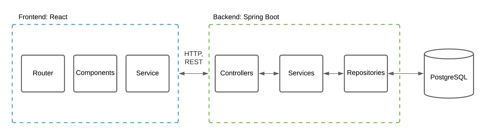

# TechBip

TechBip is a web application representing the implementation of the incident and knowledge management ITIL processes as part of a university project.

- Frontend application: [`https://techbip.herokuapp.com`](https://techbip.herokuapp.com/) <br>
- Backend application: [`https://techbip-server.herokuapp.com`](https://techbip-server.herokuapp.com/) <br>
- Swagger UI: [`https://techbip-server.herokuapp.com/swagger-ui/`](https://techbip-server.herokuapp.com/swagger-ui/)

## Architecture

The following is a diagram of the application architecture:


## How To Use :wrench:

To clone and run this application, you will need [Git](https://git-scm.com), [Java](https://www.oracle.com/java/technologies/javase-downloads.html),
[Maven](https://maven.apache.org/download.cgi), [PostgreSQL](https://www.postgresql.org/download/) and [Node.js](https://nodejs.org/en/download/).

```bash
# Clone this repository
$ git clone https://github.com/kkadusic/ppis-projekat

# Go into the root directory
$ cd ppis-projekat
```

- ##### Backend application
```bash
# Add following environment variables:
JDBC_DATABASE_URL=
JDBC_DATABASE_USERNAME=
JDBC_DATABASE_PASSWORD=
SCHEMA_DB=
JWT_SECRET=
JWT_EXPIRATION=
```

```bash
# Go into the backend directory
$ cd backend

# Run the server
$ mvn spring-boot:run
```

- ##### Frontend application
```bash
# Add following environment variables:
REACT_APP_API_URL=
```

```bash
# Go into the frontend directory
$ cd frontend

# Install dependencies
$ npm install

# Run the client
$ npm start
```
